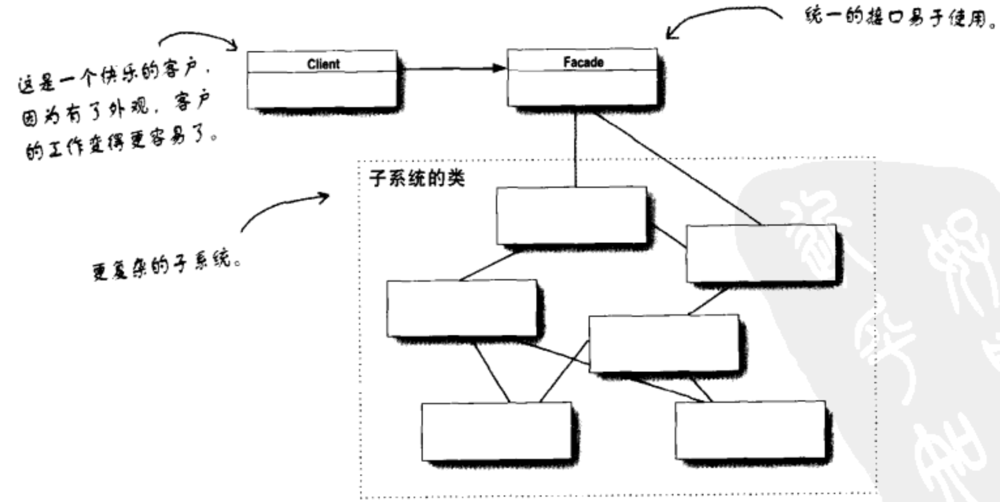

# 适配者模式

## 思路
* 适配器改变了插座的接口，以符合美式笔记本的需求
* 将一个接口转换为另一个接口，以符合客户的期望

## 客户使用适配器的过程
* 客户通过目标接口 调用适配器的方法 对适配器发出请求
* 适配器使用被适配者接口 把请求转换为被适配者的一个或者多个接口
* 客户接收到调用结果，但是没有发觉是适配器在起作用

## 定义
将一个类的接口，转换为客户期望的另一个接口。适配器让原本接口不兼容的类可以合作无间

# 外观模式

## 作用
将一个或者数个类的复杂的一切都隐藏在身后，只露出一个干净美好的外观

## 定义
提供一个统一的接口，用来访问子系统中的一群接口。外观模式定义了一个高层接口，让系统更容易使用

## 示例
家里的影音系统，需要涉及到影印机，爆米花机器，窗帘机器。我们用一个接口可以统筹兼顾所有的机器

# 设计原则
最少知识原则
* 减少对象之间的交互
* 只和你的密友交谈

设计的时候，不要让太多的类耦合在一起，免得修改了一部分，会影响到其他的部分。如果许多类之间相互依赖，那么这个类就是个易碎的系统，不易了解和维护

