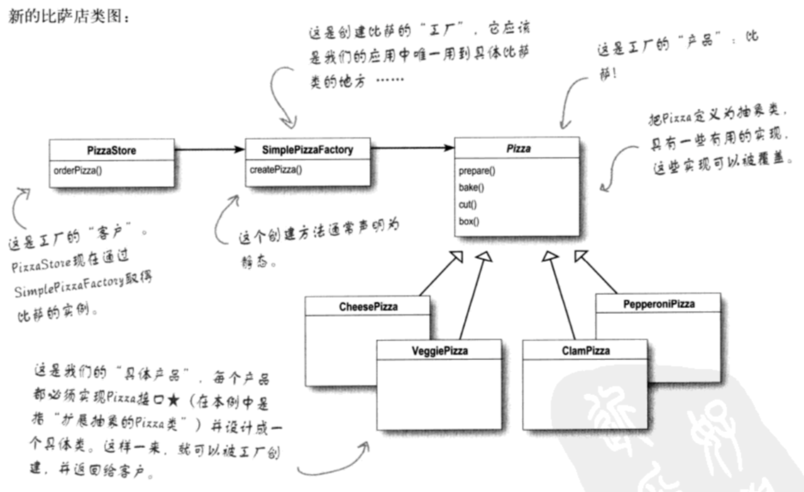
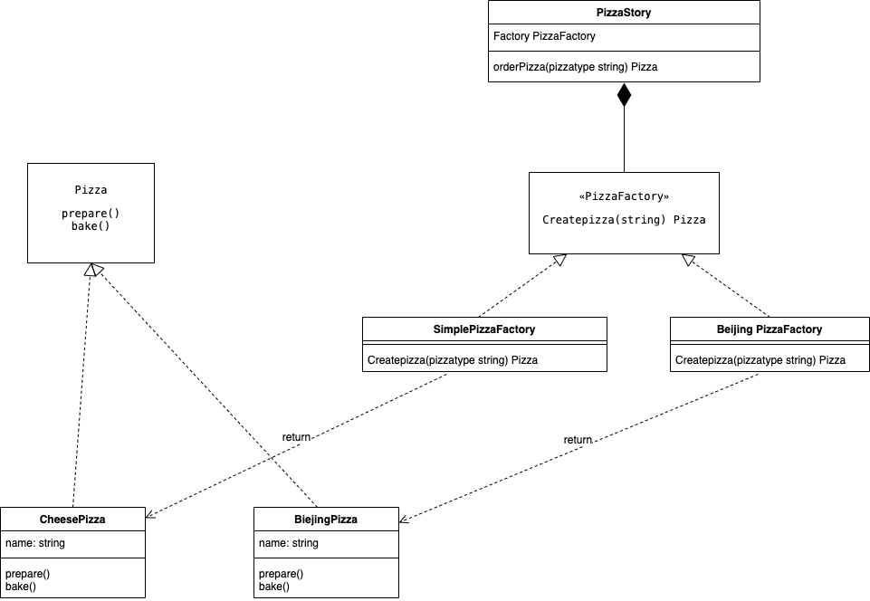
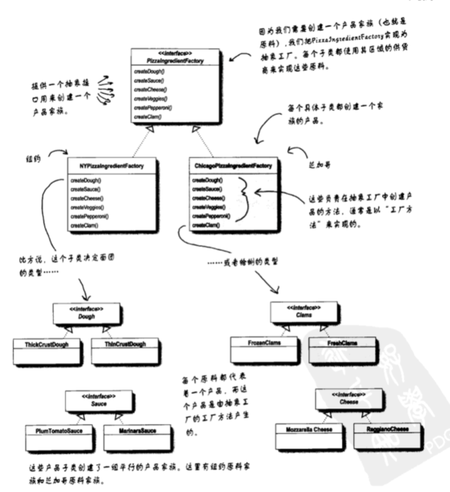

# 工厂模式
## 流程
如果我们要生成很多不同类型的披萨，那我我们在初始化逻辑的时候，就可能需要各种判断，这些逻辑不应该放在初始化的逻辑里。这些逻辑我们应该抽出来。

我们应该把创建披萨的代码放到另外一个对象中，由这个新对象专职创建披萨，也就是simplepizzafactory

工厂方法用来处理对象的创建，并将这样的行为封装在子类中，这样，客户程序中关于超类的代码和子类对象创建代码解耦了

所有工厂模式都用来封装对象的创建

现在 order 是统一的流程，但是createpizza是不同的，create pizza会根据不同的小店做出不同的披萨

## UML 图

* 简单工厂

* 工厂模式  
我们允许用户自己做决定要创建的子类是什么。 比如createpizza  其实是把createpizza放在了子工厂中来做      工厂方法模式定义了一个创建对象的接口，但由**子类决定要实例化的类是哪一个**，工厂方法让类把实例化推迟到了子类

* 抽象工厂模式

将ingredientfactory放到了factory中，初始化factory的时候， 将ingredientfactory作为参数初始化factory。而抽象工厂就是在搞ingreditentfatory的时候体现出来的. ingredientfactory会传递到pizzastrore中，并且在pizza中被引用

这个部分可以放到抽象工厂模式的 PizzaFacotry 中，作为其中的一个参数

提供了一个接口，用来创建相关或者依赖对象的家族，而不需要指定具体类

## 优点
* 帮助我们将产品的实现从使用中解耦出来，无论是我们增加产品还是改变产品，createor都不会受到影响

## 总结
工厂方法模式定义了一个创建对象的接口，但由**子类决定要实例化的类是哪一个**，工厂方法让类把实例化推迟到了子类

## 原则
依赖倒置原则： 要依赖抽象，不要依赖具体类。不能让高组件依赖于低组件，不管高低组件，都应该依赖于抽象 

之前可能是 pizzastore -> pizza， pizzastore直接实例化各种pizza 

应用这个原则之后：pizzastore 依赖pizza接口，facotry实现了pizza这些接口

pizzastore->  pizza <- facotry

[依赖倒置](https://zhuanlan.zhihu.com/p/92488185)