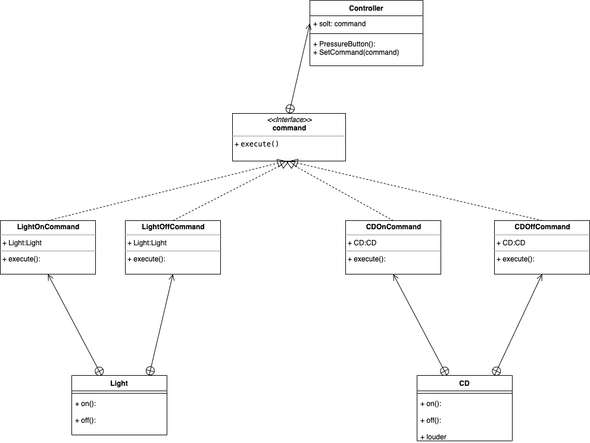

# 命令模式

## 定义
把请求封装成对象，

                                                                                                                                                                                    